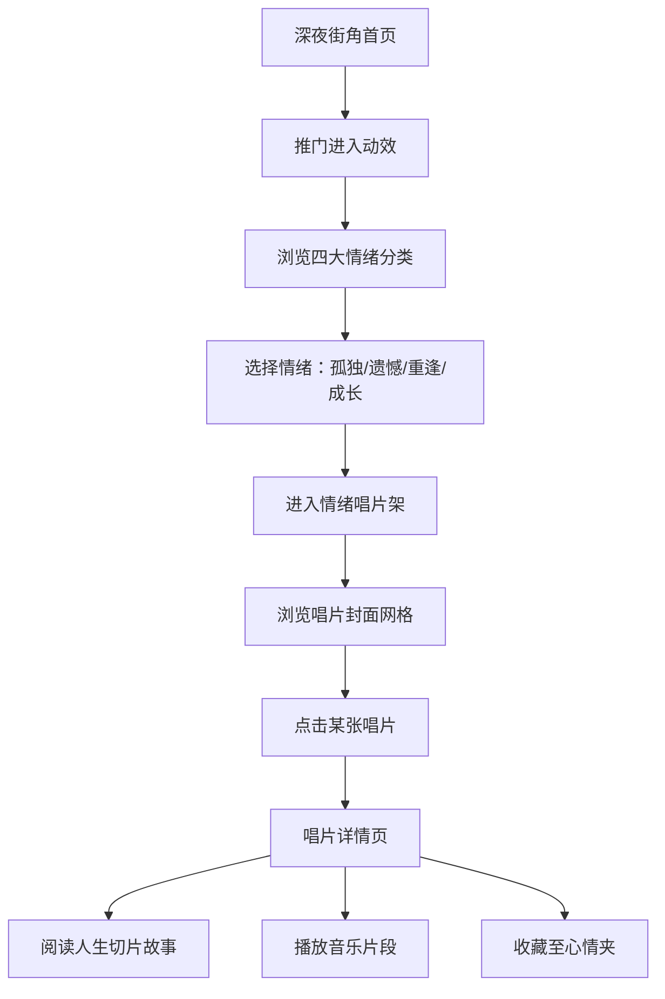

## 1. 产品概述

「深夜唱片行」—— 一个收藏情绪而非售卖唱片的线上空间，以陈奕迅歌曲气质为灵魂，让每一位访客在深夜街角的暖黄灯光下，邂逅属于自己的人生切片。

- 核心目的：为都市人提供一个情绪安放的数字空间，通过音乐与文字的结合，让孤独、遗憾、重逢、成长等复杂情感找到共鸣与归宿
- 目标用户：喜欢陈奕迅、有故事、需要情绪出口的都市年轻人

---

## 2. 核心功能

### 2.1 用户角色

| 角色 | 进入方式 | 核心权限 |
|------|----------|----------|
| 访客 | 直接进入 | 浏览情绪唱片架、查看唱片详情、播放音乐片段、收藏至"我的心情" |

### 2.2 功能模块

1. **首页（深夜街角）**：门店招牌动画、橱窗展示、情绪入口、今日推荐唱片
2. **情绪唱片架**：四大情绪分类（孤独/遗憾/重逢/成长），每张唱片为一个人生切片
3. **唱片详情页**：歌曲故事、歌词摘录、人生片段、相关推荐、播放控制
4. **心情收藏夹**：访客收藏的唱片，形成个人情绪档案

### 2.3 页面详情

| 页面名称 | 模块名称 | 功能描述 |
|----------|----------|----------|
| 首页 | 深夜街角场景 | 滚动视差的霓虹街景、旧店铺招牌闪烁动画、开门进入动效 |
| 首页 | 橱窗展示 | 今日推荐3张唱片，悬停时封面微旋转、暖黄灯光聚焦 |
| 首页 | 情绪入口 | 四大情绪分类门匾，点击进入对应唱片架 |
| 情绪唱片架 | 分类切换 | 顶部情绪标签切换，切换时胶片过渡动画 |
| 情绪唱片架 | 唱片网格 | 复古黑胶封面展示，悬停有唱针滑动动效 |
| 唱片详情页 | 黑胶唱机 | 模拟黑胶唱片旋转，可播放/暂停音乐片段 |
| 唱片详情页 | 人生切片 | 歌曲对应的故事散文、歌词金句、时代背景 |
| 唱片详情页 | 收藏按钮 | 心形霓虹灯按钮，点击后发光闪烁 |

---

## 3. 核心流程

访客从深夜街角推门进入 → 浏览四大情绪分类 → 选择一种情绪进入唱片架 → 翻阅该情绪下的多张唱片 → 点击某张唱片查看详情与人生故事 → 播放音乐片段感受氛围 → 若产生共鸣则收藏至个人心情夹

---

## 4. 用户界面设计

### 4.1 设计风格

**色彩系统：**
- 主色调：深夜蓝 `#1a1410`、暖黄灯 `#f4c542`
- 辅助色：霓虹粉 `#ff6b9d`、霓虹青 `#4ecdc4`、旧胶片棕 `#8b6914`
- 背景色：渐变深夜黑到暖黄光晕
- 文字色：暖米白 `#f5e6c8`、淡金 `#d4af37`

**按钮风格：**
- 霓虹灯效果按钮，发光边框
- 悬停时灯光脉动动画
- 圆角胶囊或复古招牌形

**字体：**
- 标题字体：Noto Serif SC（衬线体，复古感）
- 正文字体：LXGW WenKai / ZCOOL XiaoWei（手写/文艺气质）
- 霓虹招牌字体：特殊发光效果的繁体中文

**布局风格：**
- 不对称重叠布局，模拟真实唱片店的杂乱温馨感
- 大量使用纸张纹理、胶片颗粒、灰尘划痕做旧效果
- 层次丰富的阴影，模拟真实灯光照射

**动效特色：**
- 页面载入：霓虹灯管逐一点亮的招牌动画
- 唱片悬停：黑胶唱片微微浮起，暖黄聚光灯聚焦
- 页面切换：胶片卷动过渡效果
- 文字出现：打字机逐字显现，模拟旧电影字幕

### 4.2 页面设计概览

| 页面名称 | 模块名称 | UI元素细节 |
|----------|----------|------------|
| 首页 | 深夜街角 | 深色渐变背景，远处霓虹高楼剪影，雨水倒影效果，前景是暖黄灯光的旧店铺门面，写着"深夜唱片行"的发光招牌 |
| 首页 | 橱窗展示 | 木质窗框，内部3张黑胶唱片呈扇形排列，每张封面下有手写体歌名，悬停时唱片从封套滑出1/3 |
| 首页 | 情绪门匾 | 四块复古木质门匾，分别写"孤独"、"遗憾"、"重逢"、"成长"，匾后透出不同颜色的霓虹灯光 |
| 情绪唱片架 | 分类标签 | 顶部横向排列，选中标签有霓虹下划线发光，标签切换时背景有淡入淡出的胶片纹理 |
| 情绪唱片架 | 唱片网格 | 每行3-4张，黑胶封套有做旧磨损效果，左上角有价格标签样式的情绪贴纸，悬停时唱针图标从右上角滑入 |
| 唱片详情页 | 黑胶唱机 | 左侧大号黑胶唱片持续旋转，中间是金属唱臂，点击唱头可播放/暂停，唱片中心是歌曲名字浮雕 |
| 唱片详情页 | 人生切片 | 右侧泛黄纸张样式的内容区，标题是歌曲名，正文是散文故事，穿插金句引用框，底部有"这像你的故事吗"的互动区 |

### 4.3 响应式设计

- 桌面端优先（1440px+），保持沉浸式场景感
- 平板端（768-1024px）：唱片网格从4列调整为3列，情绪门匾改为2x2布局
- 移动端（<768px）：简化场景动效，唱片网格改为2列，唱机详情改为上下布局
- 所有触控元素保持最小44px触控区域

### 4.4 视觉氛围指引

- **整体环境**：模拟深夜11点的香港街角，潮湿空气感，远处有霓虹灯和计程车灯的微光
- **灯光层次**：店铺招牌暖黄主光源、橱窗内聚光射灯、情绪门匾背后霓虹补光、文字处的阅读灯效果
- **质感叠加**：全屏幕覆盖轻微胶片颗粒 + 偶尔的胶片划痕闪过 + 暖色调色
- **声音暗示**：页面角落有"♪ 正在播放"的小标签，点击可开启/关闭环境音效（雨声+爵士钢琴背景）
