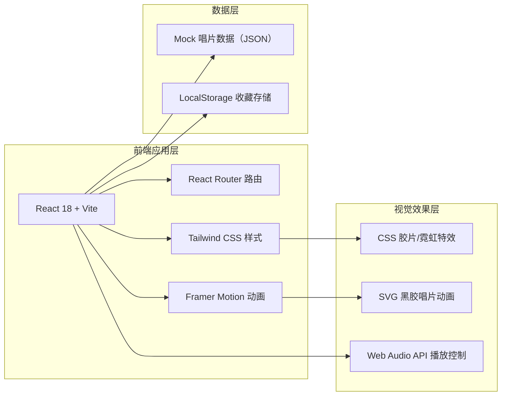
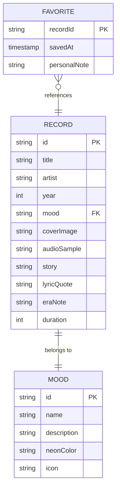

## 1. 架构设计



## 2. 技术选型说明

- **前端框架**：React@18 + TypeScript —— 组件化开发，便于封装唱片、唱机、情绪架等复用模块
- **构建工具**：Vite@5 —— 极速冷启动与HMR，适合创意项目快速迭代
- **样式方案**：Tailwind CSS@3 + 自定义插件 —— 快速构建复杂布局，配合自定义CSS实现胶片、霓虹等特殊效果
- **路由方案**：React Router@6 —— 首页 / 情绪架 / 唱片详情 / 收藏夹 多页面切换
- **动画方案**：Framer Motion@11 —— 实现招牌点亮、唱片旋转、场景过渡等高质量动画
- **音频播放**：原生 Web Audio API + HTMLAudioElement —— 播放音乐片段与环境音
- **数据持久化**：LocalStorage —— 存储用户收藏的情绪唱片
- **数据来源**：内置 Mock JSON 数据 —— 陈奕迅经典歌曲的情绪分类与故事文案

## 3. 路由定义

| 路由路径 | 页面用途 |
|----------|----------|
| `/` | 深夜街角首页 - 店铺门面与情绪入口 |
| `/shelves/:mood` | 情绪唱片架 - 按情绪分类浏览唱片（mood: lonely/regret/reunion/growth） |
| `/record/:id` | 唱片详情页 - 黑胶唱机 + 人生切片故事 |
| `/favorites` | 心情收藏夹 - 用户收藏的个人情绪档案 |

## 4. 核心数据模型

### 4.1 数据模型定义



### 4.2 唱片数据结构示例（TypeScript）

```typescript
interface Mood {
  id: 'lonely' | 'regret' | 'reunion' | 'growth';
  name: string;
  description: string;
  neonColor: string;
  bgGradient: string;
}

interface Record {
  id: string;
  title: string;
  artist: string;
  year: number;
  album: string;
  mood: Mood['id'];
  coverEmoji: string;
  coverColors: [string, string];
  story: string;
  lyricQuote: string;
  eraNote: string;
  duration: string;
  tags: string[];
}

interface Favorite {
  recordId: string;
  savedAt: number;
  personalNote?: string;
}
```

### 4.3 Mock 数据规模

- **情绪分类**：4 个（孤独 / 遗憾 / 重逢 / 成长）
- **唱片数据**：每个情绪分类 5-6 张，共约 20-24 张陈奕迅经典歌曲
- **每张唱片包含**：歌曲名、发行年、所属专辑、情绪分类、封面配色、人生故事（150-200字）、歌词金句、时代注解

## 5. 核心组件结构

```
src/
├── components/
│   ├── layout/
│   │   ├── NeonSign.tsx         # 霓虹招牌组件
│   │   ├── FilmGrain.tsx        # 胶片颗粒覆盖层
│   │   ├── WarmLight.tsx        # 暖黄灯光效果
│   │   └── CityBackground.tsx   # 深夜城市背景
│   ├── home/
│   │   ├── StoreFront.tsx       # 店铺门面场景
│   │   ├── ShowcaseWindow.tsx   # 橱窗展示
│   │   └── MoodDoors.tsx        # 情绪门匾入口
│   ├── shelf/
│   │   ├── MoodTabs.tsx         # 情绪分类标签
│   │   ├── RecordCover.tsx      # 唱片封面卡片
│   │   └── RecordGrid.tsx       # 唱片网格布局
│   ├── detail/
│   │   ├── VinylPlayer.tsx      # 黑胶唱机（含旋转动画）
│   │   ├── StoryPaper.tsx       # 泛黄纸张故事区
│   │   ├── LyricQuote.tsx       # 歌词金句引用
│   │   └── FavoriteButton.tsx   # 霓虹心形收藏按钮
│   └── shared/
│       ├── FilmTransition.tsx   # 胶片转场动画
│       └── AudioPlayer.tsx      # 音频播放控制
├── pages/
│   ├── HomePage.tsx
│   ├── ShelfPage.tsx
│   ├── RecordDetailPage.tsx
│   └── FavoritesPage.tsx
├── data/
│   ├── moods.ts
│   └── records.ts
├── hooks/
│   ├── useAudioPlayer.ts
│   └── useFavorites.ts
├── styles/
│   └── globals.css              # 自定义霓虹/胶片/灯光样式
└── App.tsx
```

## 6. 性能与体验优化

- **图片策略**：唱片封面使用 CSS 渐变 + Emoji 组合生成，无需加载外部图片资源
- **音频策略**：音乐片段使用短时长（15-30秒）低码率音频，懒加载
- **动画策略**：使用 CSS transform/opacity 硬件加速属性，复杂动画委托 Framer Motion
- **首屏优化**：关键场景组件懒加载，首页动效使用 Intersection Observer 触发
- **离线可用**：核心数据内置打包，无外部 API 依赖，可完全离线运行
